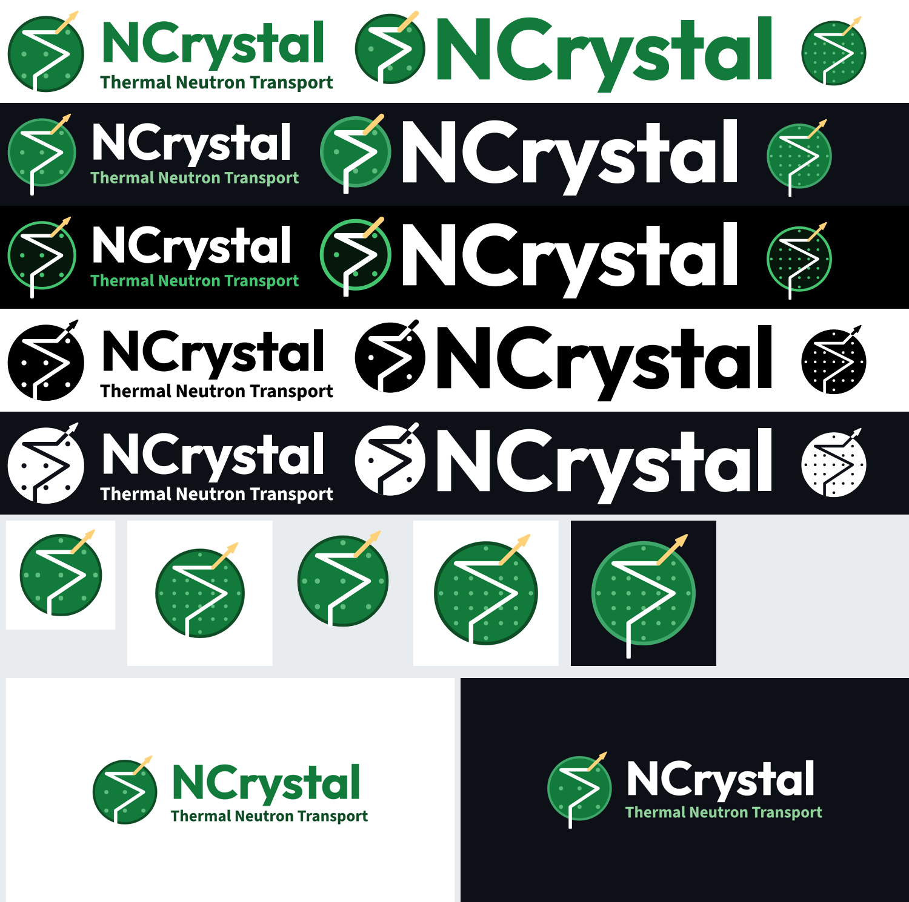
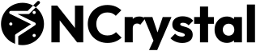
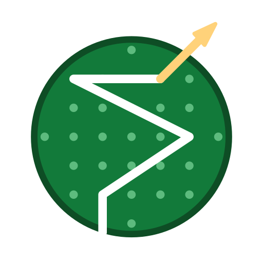

<p align="center">
  <picture>
    <source media="(prefers-color-scheme: dark)" srcset="svg/ncrystal-logo-dark.svg">
    
  </picture>
</p>

# NCrystal logo

The official logo of [NCrystal](https://github.com/mctools/ncrystal): a neutron enters a
crystal, scatters on its atoms and leaves, with the last flight drawn in yellow.

All text is converted to outlines, so no fonts are needed to display any of the files.
Except where noted, backgrounds are transparent.



## Usage note

You are welcome to use the NCrystal logo to refer to NCrystal, for example in talks,
papers, posters, websites, and in software that uses or integrates NCrystal. When doing so:

- Use the files as provided, scaled proportionally. Please don't alter the proportions,
  colours or arrangement of the logo, or combine it with other marks.
- Pick the variant that suits the background: the dark variants on dark backgrounds, the
  one-colour variants where colour isn't possible.
- Don't use the logo in a way that suggests NCrystal or its developers endorse a product,
  service or organisation, unless they actually do.

## Variants

| Suffix | Use on | Example |
|---|---|---|
| *(none)* | light pages |  |
| `-dark` | dark pages (e.g. GitHub dark) | [ncrystal-logo-dark.svg](svg/ncrystal-logo-dark.svg) |
| `-dark-outline` | dark pages, alternative | [ncrystal-logo-dark-outline.svg](svg/ncrystal-logo-dark-outline.svg) |
| `-mono-black` | one-colour print, light backgrounds |  |
| `-mono-white` | one colour on dark backgrounds or photos | [ncrystal-logo-mono-white.svg](svg/ncrystal-logo-mono-white.svg) |

The dark and white variants are white where the light ones are green, so they are hard to
see on GitHub's light theme; [preview.png](preview.png) shows them all on suitable backgrounds.

On dark backgrounds the incoming neutron is drawn below the crystal; on light and
one-colour versions the track starts at the crystal's edge.

## Shapes

| Shape | Files | Light version |
|---|---|---|
| **Logo**: icon, name and tagline | `ncrystal-logo…` |  |
| **Compact logo**: icon and name, sized to sit inline in text | `ncrystal-logo-compact…` |  |
| **Icon**: the crystal alone, square | `ncrystal-icon…` |  |

## Folders

| Folder | Contents |
|---|---|
| [`svg/`](svg/) | Vector master files: logo, compact logo and full-detail icon for every variant |
| [`svg/icon-small-sizes/`](svg/icon-small-sizes/) | The icon redrawn for small sizes: 128, 64, 32 and 16 px detail levels |
| [`pdf/`](pdf/) | Vector PDFs of the logo, compact logo and icon (for pdfLaTeX papers and Beamer) |
| [`png/icon/`](png/icon/) | Icon at 16, 24, 32, 48, 64, 96, 128, 180, 192, 256, 512, 1024, 2048 px |
| [`png/logo/`](png/logo/) | Logo at heights 64, 128, 256, 512, 1024, 2048 px |
| [`png/logo-compact/`](png/logo-compact/) | Compact logo at heights 24, 32, 48, 64, 128, 256, 512 px |
| [`web/`](web/) | Favicons and app icons (see below) |
| [`social/`](social/) | Share images and avatars, on solid backgrounds |

**About the small sizes.** The icon simplifies as it shrinks: above 192 px it shows the
full lattice; at 97–192 px nine atoms; at 33–96 px four atoms; at 32 and 16 px only the
crystal and the track. Every PNG already uses the right level. If you scale an SVG
yourself, pick the nearest file from [`svg/icon-small-sizes/`](svg/icon-small-sizes/) for
anything below about 200 px. The compact logo always uses the 64 px level, since it is
meant to be small.

| 16 px | 32 px | 64 px | 128 px | full detail |
|:-:|:-:|:-:|:-:|:-:|
|  |  |  |  |  |

Logo files are trimmed to the artwork with a ~2% margin; add clear space where you place them.

## Web

| File | Purpose |
|---|---|
| [`web/favicon.ico`](web/favicon.ico) | Classic favicon, contains 16, 32 and 48 px |
| [`web/favicon.svg`](web/favicon.svg) | Modern browsers; switches automatically between light and dark |
| [`web/apple-touch-icon.png`](web/apple-touch-icon.png) | iPhone/iPad home screen, 180 px, white background |
| [`web/android-chrome-192x192.png`](web/android-chrome-192x192.png), [`-512x512`](web/android-chrome-512x512.png) | Android / web app manifest |
| [`web/maskable-icon-192x192.png`](web/maskable-icon-192x192.png), [`-512x512`](web/maskable-icon-512x512.png) | Android adaptive icon (safe-zone padding, white background) |

```html
<link rel="icon" href="/favicon.ico" sizes="48x48">
<link rel="icon" href="/favicon.svg" type="image/svg+xml">
<link rel="apple-touch-icon" href="/apple-touch-icon.png">
<link rel="manifest" href="/site.webmanifest">
```

```json
{
  "name": "NCrystal",
  "icons": [
    { "src": "/android-chrome-192x192.png", "sizes": "192x192", "type": "image/png" },
    { "src": "/android-chrome-512x512.png", "sizes": "512x512", "type": "image/png" },
    { "src": "/maskable-icon-512x512.png", "sizes": "512x512", "type": "image/png", "purpose": "maskable" }
  ]
}
```

## Social

| File | Purpose |
|---|---|
| [`social/github-social-preview-1280x640.png`](social/github-social-preview-1280x640.png) (+ [`-dark`](social/github-social-preview-dark-1280x640.png)) | GitHub repository → Settings → Social preview |
| [`social/share-image-1200x630.png`](social/share-image-1200x630.png) (+ [`-dark`](social/share-image-dark-1200x630.png)) | Open Graph / link previews on other sites |
| [`social/avatar-1024.png`](social/avatar-1024.png) (+ [`-dark`](social/avatar-dark-1024.png)) | Square avatar, e.g. a GitHub organisation |

## Snippets

A README logo that follows the reader's light or dark theme. Within this repository use
relative paths as here; from another repository, use the files' "raw" URLs, i.e.
`https://raw.githubusercontent.com/mctools/ncrystal-logo/main/svg/ncrystal-logo.svg`.

```html
<picture>
  <source media="(prefers-color-scheme: dark)" srcset="svg/ncrystal-logo-dark.svg">
  
</picture>
```

The compact logo inline in HTML text, sized so "NCrystal" matches the surrounding text and
sits on its baseline:

```html
… provided by  through …
```

LaTeX (inline, roughly matching the text):

```latex
\raisebox{-0.166em}{\includegraphics[height=0.979em]{ncrystal-logo-compact.pdf}}
```

## Colours

| | Light | Dark | Dark outline |
|---|---|---|---|
| Crystal | `#127A3A` | `#127A3A` | `#06180C` |
| Crystal rim | `#0E4D25` | `#3FA66A` | `#43C46F` |
| Atoms | `#5DBB7E` | `#5DBB7E` | `#43C46F` |
| Neutron track | `#FFFFFF` | `#FFFFFF` | `#FFFFFF` |
| Last flight / arrow | `#FFD27A` | `#FFD27A` | `#FFD27A` |
| "NCrystal" | `#127A3A` | `#FFFFFF` | `#FFFFFF` |
| Tagline | `#0E4D25` | `#8FD19A` | `#43C46F` |

One-colour versions use pure `#000000` or `#FFFFFF`.

## Typefaces

"NCrystal" is set in **Outfit Bold** (Copyright 2021 The Outfit Project Authors) with the
tail of the *y* shortened; the tagline is **Source Sans 3 Bold** (Copyright 2010–2020 Adobe,
with Reserved Font Name "Source"). Both are licensed under the
[SIL Open Font License 1.1](https://openfontlicense.org) (OFL).

- **The logo files contain no fonts.** All letters were converted to plain vector shapes,
  so these files do not distribute font software, and the OFL's conditions do not apply
  to them.
- **Use is unrestricted.** The OFL allows the fonts to be used for any purpose, including
  logos and commercial work, with no fee and no attribution required in the artwork.
- **Shortening the *y*** edits the logo drawing, not the font, so it is not a "Modified
  Version" in the OFL's sense.
- **The OFL's restrictions only concern the font files themselves:** they may not be sold
  on their own; a modified font must not use the original name (for Source Sans 3, "Source"
  is a reserved name and an Adobe trademark); and if the font files are redistributed, the
  licence text must accompany them.
- **To recreate or edit the logo text**, get the fonts from Google Fonts:
  [Outfit](https://fonts.google.com/specimen/Outfit) and
  [Source Sans 3](https://fonts.google.com/specimen/Source+Sans+3).

## License

The files in this repository are licensed under the [Apache License 2.0](LICENSE).
As stated in its section 6, that licence does not grant permission to use the NCrystal
name or logo as a trademark beyond what is needed to describe the origin of the work;
the [usage note](#usage-note) above describes how the project would like the logo used.
